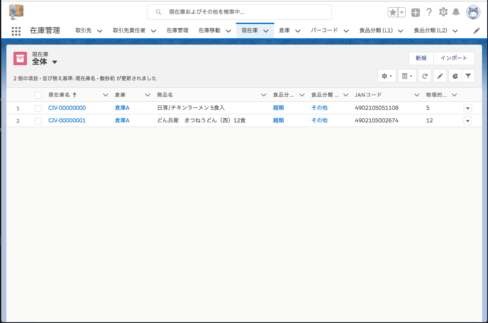

# Force.com フードバンク向け在庫管理システム 

「フードバンク向け在庫管理システム」は、フードバンクを始めとするNPO法人で利用されることを想定した、食品在庫管理システムです。

iPhone や Android端末とBluetoothのバーコードスキャナーを使って極力手入力をすることなく、正確に在庫管理業務を行うことが出来ます。

JANコードを利用する事により、寄贈された食品情報を自動的に検出することが出来ます。(※別途Yahoo APIを利用)

